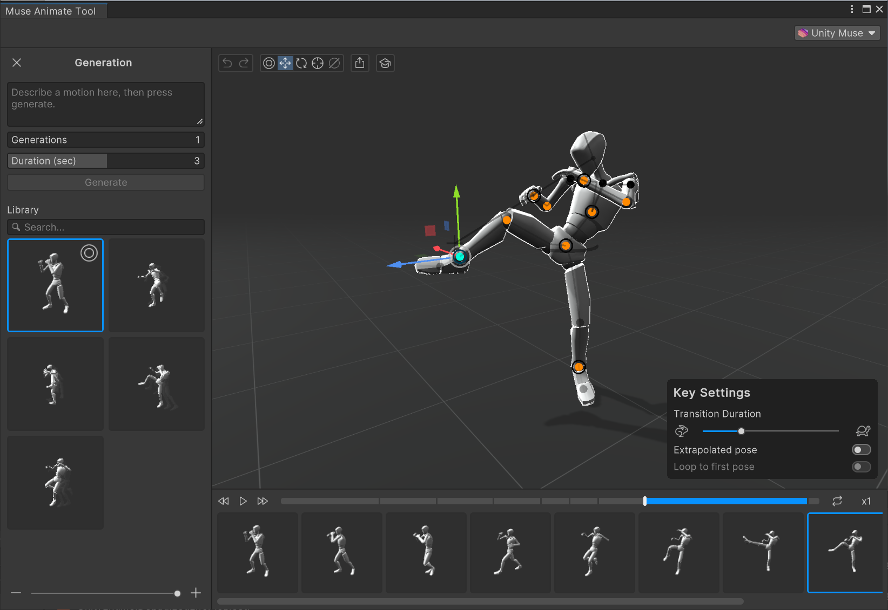

# Get started with Muse Animate

Muse Animate is a tool that uses machine learning (ML) to generate animations based on the prompt you enter. It also allows you edit your animations aided by our ML posing and motion completion algorithms.

## Launch the tool

1. Install the `com.unity.muse.animate` package if you haven't done so. For instructions, refer to [Install a package from a registry by name](https://docs.unity3d.com/Manual/upm-ui-quick.html).
2. From the menu, select **Muse** > **New Animate Generator**.
3. Resize the **Muse Animate Tool** window until you can see all the UI.

> [!TIP]
> When possible, dock the **Muse Animate Tool** window. This keeps you from losing the window and launching it multiple times.

## Additional resources

* [Unity AI FAQ](https://unity.com/ai/faq)
* [Muse feature setup](https://unity.com/products/muse/onboarding)
